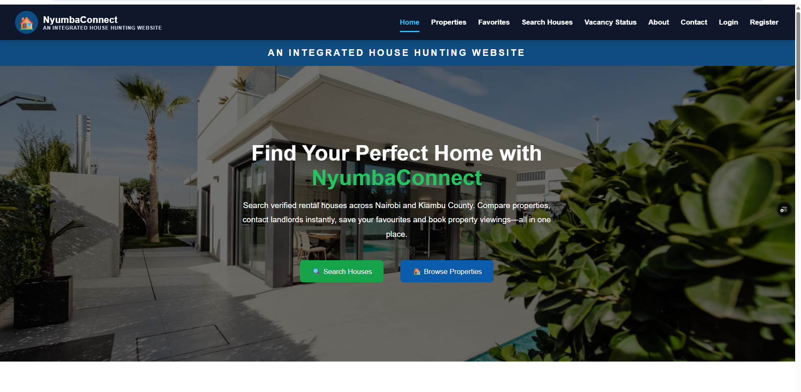

# 🏠 NyumbaConnect

NyumbaConnect is an **Integrated House Hunting Website** developed using **React** and **Vite**. The platform helps tenants search for rental houses while allowing landlords, caretakers, and administrators to efficiently manage properties and viewing requests.

---

## 🌐 Live Demo

https://nyumba-connect-two.vercel.app/

---

## 💻 GitHub Repository

https://github.com/nyanjewinnie/NyumbaConnect

---

## ✨ Features

- 🏡 Browse available rental houses
- 🔍 Search and filter properties
- 📍 View detailed property information
- ❤️ Add houses to Favorites
- 📅 Request property viewings
- 🟢 Vacancy Status tracking
- 👤 Tenant Dashboard
- 🏠 Landlord Dashboard
- 🛠 Caretaker Dashboard
- ⚙️ Admin Dashboard
- 📞 Contact page
- ℹ️ About page
- 📱 Responsive design

---

## 🛠 Technologies Used

- React
- Vite
- JavaScript (ES6)
- React Router DOM
- CSS3
- HTML5

---

## 📂 Project Structure

```text
NyumbaConnect/
│
├── client/
│   ├── src/
│   ├── public/
│   ├── screenshots/
│   ├── package.json
│   └── vite.config.js
│
└── README.md
```

---

## 🚀 Installation

Clone the repository

```bash
git clone https://github.com/nyanjewinnie/NyumbaConnect.git
```

Navigate to the project

```bash
cd NyumbaConnect/client
```

Install dependencies

```bash
npm install
```

Run the development server

```bash
npm run dev
```

Build for production

```bash
npm run build
```

---

# 📸 Project Screenshots

## 🏠 Home Page



---

## 🏘 Properties Page


---

## 📄 Property Details


---

## ❤️ Favourite Page


---

## 👤 Tenant Dashboard


---

## 🏠 Landlord Dashboard


---

## 📅 Viewing Request


---

## 📞 Contact Page


---

## 🔮 Future Improvements

- Firebase Authentication
- Firestore Database
- Google Maps Integration
- Property Image Uploads
- Online Rent Payments
- Email Notifications
- Chat between tenants and landlords
- Property Reviews and Ratings

---

## 👩‍💻 Author

**Winnie Nyanje**

Bachelor of Business and Information Technology (BBIT)

Kiriri Women's University of Science and Technology

2026

---

## ⭐ Support

If you like this project, consider giving it a ⭐ on GitHub.